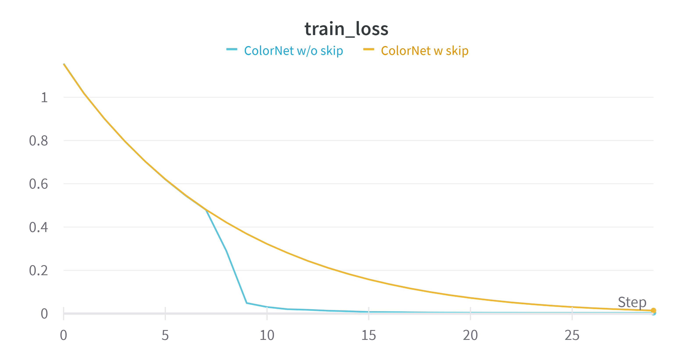

# Image Colorization using Convolutional Autoencoder

This project is part of the assessmnet of the course `BITS F312: Neural Networks and Fuzzy Logic`.

The idea of the project is to convert a grayscale image to RGB image using Deep Learning.

To achieve this, instead of directly predicting RBG image from GRAYSCALE image using a network, we exploit the relation between them i.e,

```
In LAB colorspace, the L-channel of GRAYSCALE image and that of RGB image is same

```

Hence, it decided that to predict A,B channels using L-channel instead of R,G,B channels using GRAYSCALE image.


Convolutional Autoencoder is used as the architecture and all data to network (input/output) is between 0 and 1.

## Results




